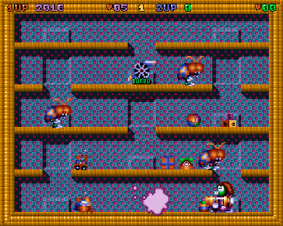

# Super Methane Brothers

A conversion of the Commodore Amiga game *Super Methane Brothers*, running on
Linux, Windows and Android.

Puff and Blow each carry a methane gas gun. Trap a bad guy in a cloud of gas,
suck the cloud into the gun, then throw it at a wall to destroy him.



---

## Building

### Linux

```bash
cmake -S . -B build -DCMAKE_BUILD_TYPE=Release
cmake --build build
build/methane
```

Prerequisites on Debian and Ubuntu:

```bash
sudo apt install cmake g++ libxrender-dev libasound2-dev libxinerama-dev libvulkan-dev
```

A debug build additionally needs the Vulkan validation layers:

```bash
cmake -S . -B build -DCMAKE_BUILD_TYPE=Debug
cmake --build build
sudo apt install vulkan-validationlayers
```

### Windows

From a Visual Studio Developer Command Prompt, with the
[Vulkan SDK](https://vulkan.lunarg.com/sdk/home) installed:

```
cmake -S . -B build -G "Visual Studio 17 2022"
```

or

```
cmake -S . -B build -G "Visual Studio 18 2026"
```

Then open the solution in the `build` folder.

### Android

Open the `android` folder in Android Studio and let Gradle sync. Or, from that
folder, `./gradlew :app:assembleDebug`.

| | |
| --- | --- |
| Minimum | Android 8.0, API 26 |
| Built for | `arm64-v8a`, `x86_64` |
| Renderer | Vulkan 1.1 |
| NDK | 28.2.13676358 |
| CMake | 3.22.1 |

Debug builds look for the Vulkan validation layer in
`android/app/src/debug/jniLibs/<abi>/libVkLayer_khronos_validation.so`. 
Download `android-binaries-<version>.zip` from the
[Vulkan-ValidationLayers releases](https://github.com/KhronosGroup/Vulkan-ValidationLayers/releases),
which already has the ABI folders laid out, and copy the ones you build for
into `src/debug/jniLibs/`. 

---

## Playing

| | |
| --- | --- |
| Move | Left and right |
| Jump | Up - hold it to jump higher |
| Descend | Down, once you have the wings |
| Shoot | Tap fire |
| Suck | Hold fire |
| Throw | Release fire |

Player one uses the cursor keys and CTRL; player two uses W, A, S, D and SHIFT.
A gamepad or joystick can be chosen for either player from the Options screen.

On a touch screen the game draws its own D-pad and fire buttons, with a back
button in the corner that returns to the title screen. There are options for a
left-handed layout, and for playing in portrait or either landscape
orientation.

Settings and high scores are remembered between runs. On Android they are kept
in the application's private directory, and elsewhere under the usual per-user
configuration path.

Full instructions are on the Instructions screen in the game.

---

## Developer options

A debug build sets `GLOBAL_CheatModeEnable`, which adds **Input Recording** and
**Performance Counters** to the Options screen and enables the F11 cheat key.
None of this is present in a release build.

### Input recording

The recorder captures a whole game as a list of per-frame inputs and replays it
exactly.

**Input Recording** on the Options screen cycles through three settings:

| | |
| --- | --- |
| Off | Normal play |
| RECORD | The next game is written to `replay.rec` |
| REPLAY | The next game replays `replay.rec` instead of reading the controls |

Start a game with RECORD selected and it captures both joysticks, the keys the
name entry screen reads, and the pointer, one entry per frame. Recording ends
when the game finishes and returns to its own title screen, or earlier if you
leave with Escape or the on-screen back button. F9 stops the recording without
leaving the game.

Alongside each frame of input the recorder stores a checksum of the game state
at the end of that frame. On playback the checksums are compared, so a replay
does not merely look right, it is verified. Results go to the log.

```
[recorder] Playback stopped: 17905 frames replayed, identical
[recorder] Playback stopped: 17905 frames replayed, DIVERGED at frame 337 (2 frames differ)
```

A replay runs at normal speed so you can watch it. To get through a long one
quickly, set **Show FPS** to 100 FPS or Full Speed.

---

## Licence

This conversion is free software, released under the GNU General Public License
version 2 or later. See [copying.txt](copying.txt) for the full text.

**The original Amiga version of Super Methane Brothers remains a commercial
game, and its licence has not changed.** Permission was given by Apache Software
Ltd to release *this conversion* under the GPL. Only the source code in this
repository is covered by it.

Portions are derived from ClanLib, which is distributed under a zlib style licence.

See [authors.txt](authors.txt) for credits, including the original Amiga
development team, and [history.txt](history.txt) for the version history.

<https://github.com/rombust/Methane>
